  

  

  

    I build across computer science and automatic control: software systems, algorithms, AI tools, embedded hardware, signal chains, and control logic.
     
    My strength is full-stack project delivery across academic foundations and engineering practice, from theory and modeling to firmware, circuits, dashboards, and deployed products.
  

  

    
    
    
  

  

    
    
  

  摘要：计算机科学与自动控制学科方向，覆盖算法、软件、AI、嵌入式、控制系统与项目全栈落地。

  <a href="#profile-snapshot">Profile</a> ·
  <a href="#featured-work">Featured Work</a> ·
  <a href="#engineering-highlights">Highlights</a> ·
  <a href="#capability-map">Capabilities</a> ·
  <a href="#toolbox">Toolbox</a> ·
  <a href="#github-activity">Activity</a> ·
  <a href="#creator-profile">Creator</a> ·
  <a href="#contact">Contact</a>

---

## Profile Snapshot

<table>
  <tr>
    <td width="25%" valign="top">
       
      <strong>Computer Science</strong> 
      Algorithms, data structures, software architecture, databases, operating environments, automation, and performance.
    </td>
    <td width="25%" valign="top">
       
      <strong>Automatic Control</strong> 
      Feedback loops, dynamic systems, signal flow, control logic, sensors, actuators, and real-world constraints.
    </td>
    <td width="25%" valign="top">
       
      <strong>Project Full Stack</strong> 
      Frontend, backend, AI models, firmware, hardware signals, control strategies, data visualization, and deployment.
    </td>
    <td width="25%" valign="top">
       
      <strong>AI & Hardware Systems</strong> 
      FPGA, STM32, ESP32, OpenMV, LiDAR, computer vision, IoT security, and software-hardware co-design.
    </td>
  </tr>
</table>

<table>
  <tr>
    <td width="33%" valign="top">
      <strong>Academic-to-engineering bridge</strong> 
      Turn CS and control theory into runnable systems, measurable experiments, and usable products.
    </td>
    <td width="33%" valign="top">
      <strong>Control-aware products</strong> 
      Systems where software interfaces, sensors, control logic, and operating constraints must work as one.
    </td>
    <td width="33%" valign="top">
      <strong>End-to-end project stack</strong> 
      Requirements, architecture, algorithm/model, embedded implementation, backend, frontend, testing, and iteration.
    </td>
  </tr>
</table>

---

## Featured Work

  <table>
    <tr>
      <td width="50%" align="center" valign="top">
         
        <strong>Personal management system shaped around real workflows.</strong> 
        
        
      </td>
      <td width="50%" align="center" valign="top">
         
        <strong>Browser-based remote tool for Claude Code on low-resource servers.</strong> 
        
        
      </td>
    </tr>
    <tr>
      <td width="50%" align="center" valign="top">
         
        <strong>Chrome extension for multi-site New API check-in and Cloudflare workflows.</strong> 
        
        
      </td>
      <td width="50%" align="center" valign="top">
         
        <strong>FPGA learning notes, course material, and Markdown documentation.</strong> 
        
        
      </td>
    </tr>
  </table>

---

## Engineering Highlights

<table>
  <tr>
    <td width="50%" valign="top">
      <h3>Intelligent Logistics & Laser Battle Vehicles</h3>
      
<strong>Hardware circuit design · Algorithm development · 2024.09 - 2025.08</strong>

      
Built intelligent vehicles for logistics handling and dynamic competition scenarios. Integrated LiDAR, mecanum-wheel chassis, mechanical grippers, motor drive circuits, and multi-sensor selection. Implemented YOLOv5s-based real-time target detection, LiDAR-assisted localization and obstacle avoidance, and stable grasping / stacking logic for logistics tasks.

      

        
        
        
        
      

      摘要：物流搬运小车与激光对抗小车，融合视觉、雷达、底盘控制与机械夹爪。
    </td>
    <td width="50%" valign="top">
      <h3>FPGA Multi-Function Digital Signal Debugger</h3>
      
<strong>Verilog logic · System integration · 2025.06 - 2025.11</strong>

      
Worked on a Gowin ACG720 FPGA-based debugging device. Developed Verilog logic for SPI / I2C / UART conversion, 35Msps ADC / DAC signal acquisition and generation, USB / Ethernet data transfer, real-time waveform display, protocol analysis, and FFT visualization in host software.

      

        
        
        
        
      

      摘要：基于 FPGA 的多功能数字信号调试器，覆盖协议转换、采样生成、波形显示与 FFT。
    </td>
  </tr>
  <tr>
    <td colspan="2" valign="top">
      <h3>Vehicle Part Surface Defect Vision Inspection System</h3>
      
<strong>Embedded vision · Model optimization · Web dashboard · 2024.10 - 2025.07</strong>

      
Built an industrial visual inspection system around STM32 and an improved YOLOv11 model. Integrated OpenMV camera input and ESP8266 communication, optimized six-class surface defect detection to 90.7% mAP, completed lightweight embedded deployment, and visualized inspection data through a web platform.

      

        
        
        
        
        
      

      摘要：车辆零部件表面缺陷检测，从摄像头采集、模型优化、嵌入式部署到 Web 可视化。
    </td>
  </tr>
</table>

---

## Capability Map

| Layer | Practical range |
| :-- | :-- |
| **Computer Science Foundations** | Algorithms, data structures, software engineering, operating environments, database systems, networked applications |
| **Automatic Control Foundations** | Dynamic systems, feedback control, signal flow, sensor-actuator loops, control constraints, system modeling mindset |
| **Software Full Stack** | React, Vue, Next.js, Vite, TypeScript, Node.js, Python, FastAPI, Express, REST APIs, databases, deployment |
| **AI Engineering** | Claude Code, Codex, OpenAI API, MCP, RAG, agent workflows, prompt engineering, model integration, evaluation |
| **Computer Vision** | YOLOv5s, YOLOv11, OpenMV, image preprocessing, model lightweighting, mAP optimization, embedded deployment |
| **Signals & Control** | ADC/DAC sampling, FFT analysis, SPI / I2C / UART, waveform generation, feedback systems, control logic |
| **Embedded & Hardware** | Verilog, FPGA, STM32, ESP32, ESP8266, Arduino, sensors, PCB concepts, software-hardware debugging |
| **Security Engineering** | OWASP Top 10, Burp Suite, Nmap, SQLMap, Wireshark, OpenSSL, Ghidra, IDA, IoT security, AI security |
| **Systems & DevOps** | Linux, Docker, Nginx, GitHub Actions, Cloudflare, Vercel, deployment, logs, monitoring, automation scripts |
| **Project Delivery** | Academic analysis, requirements, architecture, implementation, embedded validation, dashboard delivery, iteration |

## Toolbox

  
  
  
  
  
  
  
  
  
  
  
  
  
  
  
  
  
  
  
  
  
  
  
  
  
  
  
  
  
  
  

---

## Competition & Recognition

<table>
  <tr>
    <td width="20%" align="center" valign="top">
      <strong>Statistical Modeling</strong> 
      National Undergraduate Second Prize · 2025.05 
      
    </td>
    <td width="20%" align="center" valign="top">
      <strong>Mathematical Modeling</strong> 
      National Third Prize · 2025.06 
      
    </td>
    <td width="20%" align="center" valign="top">
      <strong>Electronic Design</strong> 
      National Competition · 2025.07 
      
    </td>
    <td width="20%" align="center" valign="top">
      <strong>Service Outsourcing</strong> 
      National Third Prize · 2025.07 
      
    </td>
    <td width="20%" align="center" valign="top">
      <strong>FPGA Innovation</strong> 
      National Third Prize · 2025.11 
      
    </td>
  </tr>
</table>

---

## GitHub Activity

  

<strong>Contribution snake</strong>

 
  <picture>
    <source media="(prefers-color-scheme: dark)" srcset="https://raw.githubusercontent.com/Aixgeekx/Aixgeekx/output/github-snake-dark.svg" />
    <source media="(prefers-color-scheme: light)" srcset="https://raw.githubusercontent.com/Aixgeekx/Aixgeekx/output/github-snake.svg" />
    
  </picture>

---

## Creator Profile

  
    
  <strong>Aix 极道工作室</strong> 
  Tech creator profile · software / AI / hardware collaboration · WeChat: Aixgeekx

  <table>
    <tr>
      <td align="center" valign="top">
         
        <strong>Aix Studio</strong> 
        Profile identity
      </td>
      <td align="center" valign="top">
         
        <strong>1,073</strong> 
        Following
      </td>
      <td align="center" valign="top">
         
        <strong>553</strong> 
        Followers
      </td>
      <td align="center" valign="top">
         
        <strong>LV5</strong> 
        Bilibili Level
      </td>
    </tr>
  </table>

  <table>
    <tr>
      <td align="center"></td>
      <td align="center"></td>
      <td align="center"></td>
      <td align="center"></td>
      <td align="center"></td>
      <td align="center"></td>
    </tr>
  </table>

  
  

---

## Current Focus

  <strong>Build the system. Test the loop. Ship the useful part.</strong>

- Building reliable AI-native development workflows and practical agent tools.
- Deepening the computer science + automatic control stack through real projects, experiments, and competition systems.
- Expanding from full-stack software toward control-aware, hardware-connected intelligent systems.
- Making FPGA, embedded, security, signal-processing, and automatic-control learning repeatable through clear experiments.
- Turning early ideas into MVPs through architecture, implementation, testing, and iteration.

---

## Contact

  

    <strong>WeChat:</strong> <code>Aixgeekx</code> ·
    <strong>Display name:</strong> <code>泰枫零</code>
  

  
  
  

